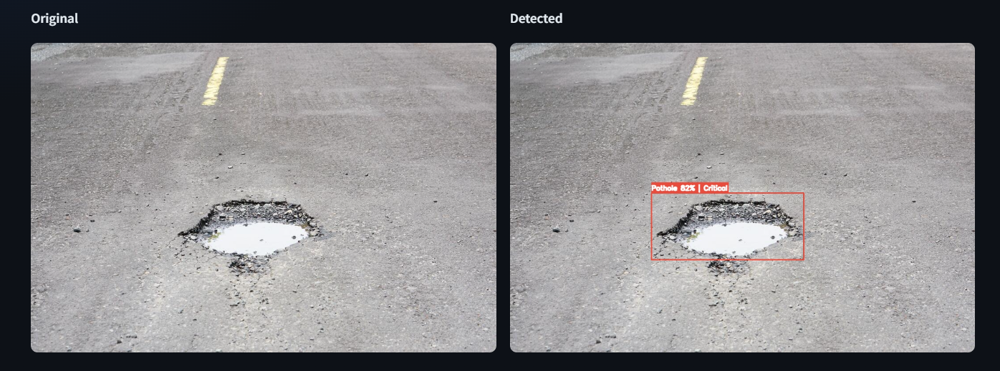

# 🛣️ Road Damage Detection

**Detects, classifies and severity-scores road damage from images and dashcam video.**
Runs entirely on CPU — no GPU, no cloud inference, no API keys.



<div align="center">

`YOLO26` · `PyTorch / ONNX` · `Streamlit` · `OpenCV` · `Folium` · `SQLite` · **126 tests**

</div>

---

## Why this exists

Manual road surveys are slow and subjective. Two inspectors looking at the same stretch
of road will rank its repairs differently. This turns a phone photo or a dashcam clip
into a ranked, geotagged damage inventory in under a second per frame — on a laptop.

The interesting engineering isn't the bounding box. It's everything around it:
making severity **consistent**, making video counts **honest**, and being clear about
what the model does and does not know.

---

## What it does

| | |
|:--|:--|
| **Detects 4 damage types** | Longitudinal crack, transverse crack, alligator crack, pothole — the RDD taxonomy |
| **Scores severity** | Weighted over damage area, type and confidence → Low / Medium / High / Critical |
| **Analyses video** | Frame-by-frame detection with IoU tracking, so one pothole across 30 frames counts **once** |
| **Exports annotated clips** | Boxes burned in, H.264 transcode for inline browser playback |
| **Maps damage** | Clustered markers coloured by severity, plus a severity-weighted heatmap |
| **Persists everything** | SQLite with cascade delete, so aggregates never drift |

```
Image / Video ──▶ YOLO ──▶ Severity scoring ──▶ SQLite ──▶ Dashboard · Map
                                                   │
                          Cross-frame IoU tracking ┘  (video only)
```

---

## Quickstart

```bash
git clone https://github.com/IhsanKT/road-damage-detector.git
cd road-damage-detector

python -m venv .venv && .venv\Scripts\activate      # Windows
pip install -r requirements.txt

python scripts/verify.py                            # health check — start here
streamlit run app/main.py --server.port 8531
```

Then open **http://localhost:8531** and try the **Detection → Samples** tab.

`verify.py` exercises every layer against real code — dependencies, model load, inference
invariants, severity boundaries, database round-trip and cascade delete, frame
deduplication, video export and transcode — then runs the test suite. It exits non-zero on
failure, so it doubles as a pre-demo gate.

```
30 passed · 0 warnings · 0 failed
```

**Without trained weights in `models/`,** the app falls back to stock COCO weights and
shows an unmissable red banner saying results are meaningless. It detects cars and people,
then mislabels them as road damage — so the app refuses to let you mistake that for a
working demo.

### Getting the model

Weights are **not committed to this repo** — they are an 85 MB binary, and git history
carries binaries forever. Pick one:

| | |
|:--|:--|
| **Train your own** *(recommended)* | [`training/train_yolo26_rdd.ipynb`](training/train_yolo26_rdd.ipynb) on a free Colab T4 — 2–4 hours, unattended |
| **Use the interim model** | Download `YOLOv8_Small_RDD.pt` from [oracl4/RoadDamageDetection](https://github.com/oracl4/RoadDamageDetection/blob/main/models/YOLOv8_Small_RDD.pt) — note the licence caveat under [Attribution](#attribution) |

Either way, place the file at `models/road_damage_best.pt`. The app detects it on startup
and the sidebar banner turns green:

```
[ok] Trained weights — 4 classes
```

Confirm with `python scripts/verify.py`.

---

## How severity is scored

```
score = 0.40 × area_factor  +  0.30 × type_factor  +  0.30 × confidence
```

`area_factor` uses a **square-root curve saturating at 15% of the frame**. Area is a
squared quantity — a crack twice as long and twice as wide covers four times the pixels —
so the square root makes the score track a damage's *linear extent* instead of its pixel
count. Without it, the boxes that dominate real road imagery (typically 0.5–8% of frame)
would all flatten to near zero on the area term, and the score would be driven almost
entirely by class and confidence.

| Band | Score | Action |
|:--|:--|:--|
| 🟢 Low | ≤ 0.30 | Monitor |
| 🟡 Medium | ≤ 0.55 | Schedule repair |
| 🟠 High | ≤ 0.75 | Priority repair |
| 🔴 Critical | ≤ 1.00 | Immediate action |

> ### This is a designed heuristic, not a civil-engineering standard
>
> It exists to rank detections against each other consistently and explainably. The
> weights were chosen by judgement, **not fitted to repair-cost or maintenance data** —
> RDD carries no ground-truth severity labels to validate against. Treat the output as a
> triage ordering, not an engineering assessment.
>
> Every weight lives in [`src/utils/constants.py`](src/utils/constants.py), tunable in one
> place.

---

## Why video needs tracking

A pothole visible for one second of 30 fps footage produces about 30 boxes. Reported
naively that is **30 potholes** — and every count, map marker and severity aggregate
downstream inherits the error.

`DamageTracker` collapses them with greedy IoU matching against recently-seen tracks:

- **Class-aware** — a pothole inside an alligator-cracked patch stays two damages
- **Tolerant of gaps** — a damage briefly occluded by a passing car keeps its track
  (`max_age = 15` frames)
- **Keeps the best view** — each track reports its most severe observation, not its first

The UI surfaces the duplication ratio directly, so the deduplication is visible rather
than implied.

Matching is deliberately simple. A Kalman filter or ByteTrack would handle occlusion
better, but forward-facing dashcam damage drifts predictably down the frame, and greedy
IoU is sufficient for it.

---

## Benchmarks

**AMD Ryzen 5 5625U** (6C/12T, no NVIDIA GPU, CPU-only PyTorch). Median of 12–15 runs
after warm-up.

| Model | Size | Median | Mean | p95 | FPS |
|:--|--:|--:|--:|--:|--:|
| `yolov8s` (RDD) | 320px | 84 ms | 90 ms | 94 ms | 11.9 |
| `yolov8s` (RDD) | 416px | 121 ms | 123 ms | 130 ms | 8.2 |
| `yolov8s` (RDD) | 640px | 254 ms | 254 ms | 259 ms | 3.9 |
| `yolo26n` (stock) | 320px | 46 ms | 51 ms | 48 ms | 21.9 |
| `yolo26n` (stock) | 416px | 58 ms | 60 ms | 62 ms | 17.2 |
| `yolo26n` (stock) | 640px | 88 ms | 90 ms | 93 ms | 11.3 |

Both are comfortably interactive on a laptop CPU with no GPU. The **small** model costs
about **2.9×** the **nano** model's latency at 640px — the trade-off to weigh when picking
weights, since video throughput scales directly with it.

Reproduce with `python scripts/benchmark.py`.

---

## Model & training

Training runs on Colab's free T4; inference runs locally on CPU.

1. Open [`training/train_yolo26_rdd.ipynb`](training/train_yolo26_rdd.ipynb) in Colab and
   set **Runtime → T4 GPU**
2. Point the dataset cell at a YOLO-format RDD dataset from Roboflow Universe
3. Run through — roughly 2–4 hours for 60 epochs, unattended
4. Drop `road_damage_best.pt` into `models/`; the app picks it up automatically,
   preferring ONNX when both are present

The notebook validates **class order** before training, not after. A dataset listing the
same four classes in a different order trains perfectly, scores well, and then mislabels
every detection in the app — with nothing raising an error. That check costs seconds and
saves a wasted training run.

### Current results

| Class | mAP@50 |
|:--|--:|
| Alligator Crack | 0.709 |
| Potholes | 0.524 |
| Longitudinal Crack | 0.501 |
| Transverse Crack | 0.454 |
| **All classes** | **0.547** |

> **0.45–0.60 mAP@50 is the realistic band** for 4-class RDD. The targets are small, often
> ambiguous, and labelled inconsistently across six countries. A score near 0.9 almost
> always means the validation split leaked into training.
>
> The class spread is the interesting part: alligator cracking (large, textured,
> distinctive) reaches 0.709, while transverse cracks — thin, low-contrast, easily
> confused with tar seams and shadows — manage 0.454. That gap is characteristic of the
> problem, not a training bug.

---

## Project layout

```
src/
  core/
    detector.py      RoadDamageDetector + Detection; pure build_detection()
    severity.py      scoring — pure functions, no I/O
    video.py         IoU tracker, frame loop, annotated export, H.264 transcode
  geo/geotagging.py  EXIF GPS extraction, manual coordinate parsing
  db/store.py        SQLite: two tables, cascade delete
  utils/             constants (taxonomy + weights), config, content-addressed uploads

app/
  main.py            overview + KPIs
  pages/             1 Detection · 2 Video · 3 Map
  shared.py          cached model/store, sidebar, styling

samples/             demo road images
training/            Colab fine-tuning notebook with class-order validation
scripts/             verify.py · benchmark.py · seed_demo_data.py
tests/               126 tests
```

Model-free logic is deliberately separated from model-bound logic. `build_detection()`
and everything in `severity.py` are pure functions, so geometry and scoring are tested
exactly, without loading a neural network.

---

## Testing

```bash
python -m pytest tests/ -q          # 126 passed
```

Covers severity maths and band boundaries, detector output invariants, IoU tracking and
deduplication, database round-trips and cascade behaviour, GPS parsing including
hemisphere signs, and headless execution of every Streamlit page.

Three regression tests worth calling out, each pinning a real bug found during
development:

- **`test_survives_the_pil_patch_ultralytics_installs`** — importing `ultralytics`
  monkey-patches `PIL.Image.open` so that *any* open failure triggers a `pip install` of
  `pi-heif`. Where site-packages isn't writable, that install fails slowly and then raises
  `ModuleNotFoundError` instead of `FileNotFoundError`, taking down any page reading EXIF
  from a corrupt upload. Auto-install is now disabled in [`src/__init__.py`](src/__init__.py).

- **`test_repeated_saves_do_not_rewrite_the_file`** — Streamlit reruns a page's entire
  script on every widget interaction, and the uploaded file object survives those reruns.
  Saving under a fresh UUID rewrote the whole upload on every slider drag: 25 reruns of a
  5 MB clip wrote 125 MB. Uploads are now content-addressed
  ([`src/utils/files.py`](src/utils/files.py)).

- **`test_a_damage_returning_after_a_long_gap_is_a_new_track`** — pins the distinction
  between a brief occlusion and a genuinely separate damage further down the road.

---

## Known limitations

- **Detection quality is the ceiling.** Every feature here sits on top of a bounding box;
  a weak model makes the polish irrelevant.
- **The model only recognises damage shot from roughly dashcam distance and angle.**
  `samples/road_07.jpg` is an unmistakable pothole to a human, and the model returns
  nothing above `conf=0.01`. It is a dark, low-angle macro close-up — far outside RDD's
  distribution of daylight, forward-facing road frames. Padding the image so the damage
  covers just 2% of the frame does not help, so this is an appearance gap rather than a
  scale one. Worth knowing before pointing a phone straight down at a pothole and
  expecting a detection.
- **Severity weights are unvalidated** — see the note above.
- **GPS is per-image or per-clip.** EXIF or manual entry only; there is no GPX track
  import, so video is geotagged at clip level rather than per frame.
- **OpenCV cannot write H.264 on most Windows builds** — and reports success while
  producing an unplayable file. Exports use `mp4v` and are transcoded for preview only
  when ffmpeg is on PATH.
- **No live webcam mode.** Browser-mediated video in Streamlit is laggy and fragile; a
  video file demonstrates the same pipeline far more reliably.

---

## Attribution

The model currently in `models/road_damage_best.pt` is **not mine**. It is
`YOLOv8_Small_RDD.pt` from
[oracl4/RoadDamageDetection](https://github.com/oracl4/RoadDamageDetection), a YOLOv8-small
model trained on the CRDDC2022 dataset. Its four classes match this project's taxonomy
exactly, in the same order, so it drops in unmodified.

It is in use as an **interim model**, so the application could be built and demonstrated
while my own training run was pending. Everything else here — detection wrapper, severity
scoring, tracking and deduplication, storage, mapping, UI and tests — is my own work.

> That repository publishes no LICENSE, so redistribution rights are unclear. The weights
> are gitignored rather than committed, and should be replaced with a self-trained model
> before this is presented as finished.

Dataset: [RDD2022](https://github.com/sekilab/RoadDamageDetector) (Arya et al.), CC BY-SA
4.0 — a multi-national road damage dataset spanning six countries.

---

## Stack

YOLO26 / YOLOv8 (Ultralytics) · PyTorch · ONNX Runtime · OpenCV · Streamlit · Folium ·
SQLite · pytest
